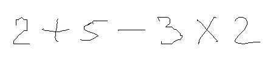
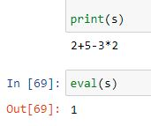

# Handwritten Equation Solver using CNN

Handwritten math symbols dataset is taken from Kaggle (https://www.kaggle.com/xainano/handwrittenmathsymbols)

1. Input images (dataset) containing hand written equations is with Convolutional Neural Network.
2. User has to input an image containing a handwrittenequation.
3. Convert the image to a binary image and then invert the image(if digits/symbols are in black).
4. Now obtain contours of the image by default, it will obtain contours from left to right.
5. Obtain bounding rectangle for each contour.
6. Sometimes, we may get two or more contours for the same digit/symbol. To avoid that, we can check if the bounding rectangle of those two contours overlaps or not. If they overlap, then discard the smaller rectangle.
7. Now, resize all the remaining bounding rectangle to 28 by 28.
8. Using our model, predict the corresponding digit/symbol for each bounding rectangle and store it in a string.
9. After that use ‘eval’ function on the string to solve the equation.

# To run the program:
You can run all the three ipynb files either separately or sequentially.

1. For running Data_extraction.ipynb first download train dataset.rar zip file and extract it in the folder containing Data_extaction.ipynb file.
2. For running train.ipynb, you either need to download train_final.csv or you can run it after succesfully running Data_extraction.ipynb.
3. For running HES_CNN.ipynb, you either need to download model_final.h5 and model_final.json file or you can run it after succesfullyn running train.ipynb file. You also need to replace the path of the image in code from the local path of image to be tested on your computer.

# Input Image:

# Output:

